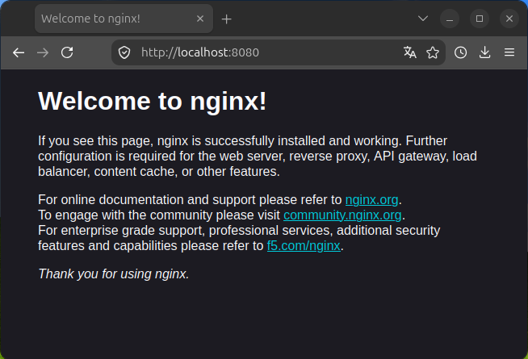
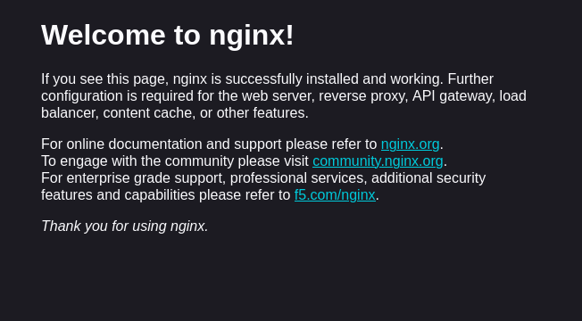

## Práctica 1 🐳

<p align="center">
  
</p>

<p align="center">
  <strong> GESTIÓN DE MÁQUINAS VIRTUALES </strong>
</p>

En este apartado comenzaremos con la **Práctica 1**, cuyo enunciado no se nos ha proporcionado directamente. En su lugar, se ha planteado mediante una serie de pequeñas tareas de dificultad incremental, a las que llamaremos **ejemplos**, que nos servirán de guía y nos permitirán avanzar progresivamente hasta completar la Práctica 1.

Para completar la Práctica 1, tendremos previamente instalados **Docker Engine** junto con **Docker Compose**. Por preferencia personal, he decidido <u>no utilizar <strong>Docker Desktop</strong></u>, al considerar que, desde una perspectiva de aprendizaje, resulta más beneficioso trabajar directamente mediante comandos. De esta forma, puedo comprender mejor qué sucede en cada paso, en lugar de utilizar una interfaz gráfica que simplifica y oculta parte de la funcionalidad, dificultando la comprensión de lo que ocurre realmente en segundo plano.

A lo largo de esta práctica, iré comentando paso a paso cómo he realizado cada uno de los ejemplos, describiendo los comandos utilizados y explicando los procesos seguidos, con el objetivo de comprender no solo cómo llevarlos a cabo, sino también qué sucede en cada etapa, hasta completar finalmente la Práctica 1.

### Seguimiento
 - [Ejemplo 1](#ejemplo-1---descarga-y-ejecución-de-un-contenedor)
 - [Ejemplo 2](#ejemplo-2---construcción-de-una-imagen-personalizada)
 - [Ejemplo 3](#Ejemplo-3)
 - [Ejemplo 4](#Ejemplo-4)
 - [Ejemplo 5](#Ejemplo-5)

 ---

## Ejemplo 1 - Descarga y ejecución de un contenedor

Primero de todo ejecutamos los dos siguientes comandos:

```bash
docker pull nginx
```

Descarga desde [Docker Hub](https://hub.docker.com) la imagen de [Nginx](https://hub.docker.com/hardened-images/catalog/dhi/nginx) (un servidor web y proxy inverso de código abierto y alto rendimiento), revisando previamente que es seguro claro 🤣. Ahora, si ejecutamos `docker images` veremos que tenemos la imagen descargada.


```bash
docker run --name mynginx -d -p 8080:80 nginx
```

Vamos a desglosar el comando anterior:

- `docker run`: crea un contenedor nuevo a partir de una imagen y lo arranca. En este caso busca una imagen llamada nginx (aparece al final del comando).

- `--name mynginx`: le asigna el nombre 'mynginx', de esta manera, podremos ejecutar comandos de manera mucho más rápida en lugar de identificar el contenedor con un ID largo.

- `-d`: significa _detached mode_, es decir, ejecuta el contenedor en segundo plano (Devuelve el control de la terminal en vez de mostrar directamente lo que está haciendo). Como lo ejecutaremos en segundo plano, Docker nos devolverá por la terminal el **ID único y completo del contenedor**, sin truncar.

- `-p 8080:80`: esta opción publica el puerto del contenedor, o un rango de puertos, al host. En este caso, **mapeamos** el puerto **8080** de nuestro ordenador (host) con el puerto **80** del contenedor. De esta manera, Docker recibe la petición en 8080 de nuestro ordenador y la dirige al 80 del contenedor al realizar **localhost:8080**.

Ahora que tenemos el contenedor arrancado y con las opciones seleccionadas, podemos realizar `docker ps` para ver un listado de los contenedores que tenemos ejecutando en ese momento. Si añadimos `-a`
al final del comando anterior, veremos el historial completo de contenedores (incluso los que no se están ejecutando). En nuestro caso, podremos comprobar que mynginx aparece en la lista y que su estado (**_STATUS_**) figura como **_Up_**, indicando que el contenedor se encuentra en ejecución.

Comprobado que el contenedor se encuentra correctamente en ejecución, podemos abrir nuestro navegador de confianza y acceder a http://localhost:8080. Si todo ha funcionado correctamente, se mostrará la página web de bienvenida de **Nginx**. ¡Ya tenemos nuestro servidor web funcionando! 🤩

<p align="center">
  
</p>

#### Explicación

Esto sucede gracias al mapeo anterior, nuestro navegador envía la petición al **puerto 8080** de nuestro ordenador, pero docker está escuchando/intermediando para ese puerto, por tanto, docker envía la conexión
al contenedor.

El contenedor mynginx, que está escuchando en el **puerto 80**, recibe la petición y busca el recurso por defecto /usr/share/nginx/html/index.html (ya que no hemos modificado nada de ese aspecto), acto seguido de encontrarlo, mynginx devuelve una respuesta HTTP al navegador, el cual, interpreta el .html y muestra la página.

##### Limpieza

Ahora que hemos terminado, podemos parar la ejecución del contenedor con el comando `docker stop mynginx`. Acto seguido desechamos el contenedor eliminándolo con el comando `docker rm mynginx`. Cabe mencionar que debemos tener muy en cuenta que **TODOS** los datos que estén dentro de la capa _writable_, una capa de almacenamiento temporal y modificable que Docker añade encima de la imagen cuando crea un contenedor, serán **ELIMINADOS**. En cambio, si tenemos guardados los datos en un **VOLUMEN** <u><strong>NO</strong> serán eliminados</u>! Finalmente, eliminaremos la imagen guardada en cache mediante el comando `docker rmi nginx`, que no eliminará los volúmenes que se pudieran haber creado.  Todavía no hemos creado volúmenes, por tanto, no es necesario realizar nada más. Cabe mencionar que no suele hacerse éste último paso, ya que las imágenes suelen ser reutilizables, mientras que los contenedores son desechables.

---

## Ejemplo 2 - Construcción de una imagen personalizada

### ⚠️ **A partir de aquí las instrucciones están INCOMPLETAS, serán completadas más adelante al terminar y tener tiempo para hacerlo, sólamente habrá explicación muy breve** ⚠️

En este ejemplo, conseguiremos construir una imagen personalizada a partir de un Dockerfile, que tendrá el siguiente contenido:

```
FROM nginx:latest
COPY index.html /usr/share/nginx/html/index.html
```

*Explicar que hace FROM, :latest y por que es conveniente o no y COPY


Además añadiremos el archivo index.html con el código de una página web personalizada:

```
<!DOCTYPE html>
<html lang="es">
<head>
	<meta charset="UTF-8">
	<title>Mi Primer Contenedor Docker</title>
</head>
<body>
	<h1>¡Hola, Docker!</h1>
</body>
</html>
```

Ahra que tenemos los archivos necesarios que hemos personalizado ya podemos crear la imagen y ejecutar un contenedor de esa imagen con los comandos:

```
docker build -t mynginximage .
```

* describir el comando, -t y .

Y ejecutamos el contenedor:

```
docker run --name mynginximage -d -p 8080:80 mynginximage
```

* describir el comando

Finalmente, ahora que el contenedor está ejecutandose, si vamos a http://localhost:8080 en nuestro navegador de confianza veremos nuestra página web personalizada funciona correctamente! 🤩

<p align="center">
  
</p>

* Explicación 

* Limpieza igual que en el exemplo 1

---

## Ejemplo 3 - Web y base de datos

En este ejemplo simularemos una pequeña app con una web y una base de datos mediante docker compose.

Para ello tendremos que añadir un archivo nuevo llamado docker-compose.yml con el siguiente código:

```
version: '3.9'

services:
  web:
    image: nginx:alpine
    ports:
      - "8080:80"
    networks:
      - internal_net
    depends_on:
      - db

  db:
    image: mysql:8.0
    environment:
      MYSQL_ROOT_PASSWORD: root
      MYSQL_DATABASE: testdb
    volumes:
      - db_data:/var/lib/mysql
    networks:
      - internal_net

networks:
  internal_net:

volumes:
  db_data:
```


## Ejemplo 4

## Ejemplo 5
